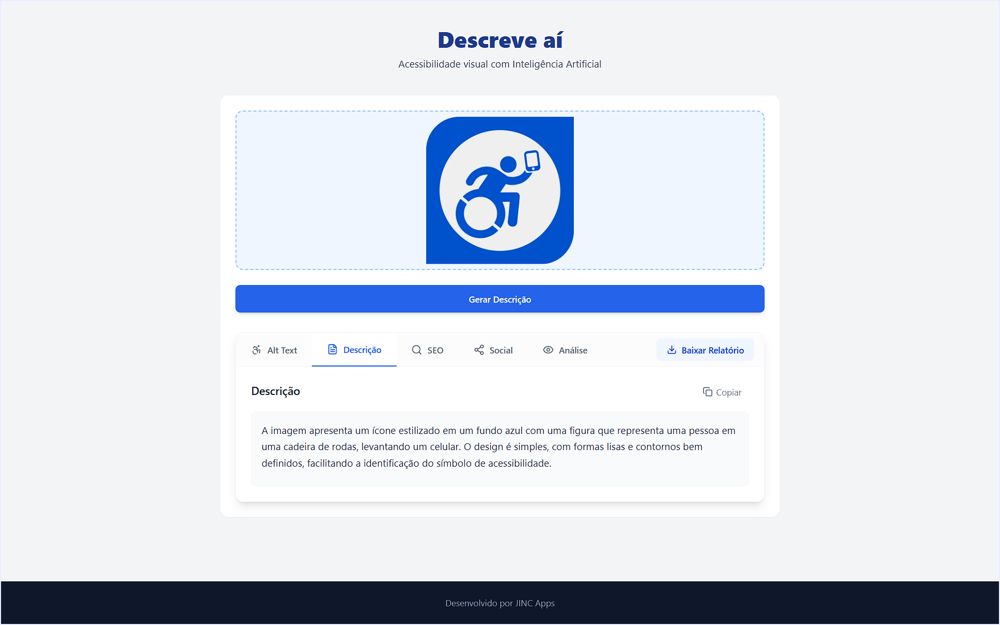

# Descreve aí: Imagens em Texto (v0.2.0-pre-alpha)



> **🚧 PRE-ALPHA:** Este software está em desenvolvimento ativo.
> Funcionalidades podem mudar sem aviso prévio. Não recomendado para uso em
> produção crítica.


**DescreveAI** é uma aplicação Fullstack que utiliza a **API da OpenAI (GPT-4o-mini)**
para gerar descrições acessíveis, SEO e conteúdo social a partir de imagens.

Desenvolvido para auxiliar criadores de conteúdo e desenvolvedores a
tornarem a web mais inclusiva (WCAG).

---

## ✨ Funcionalidades

- 🖼️ **Análise Visual com IA:** Gera descrições detalhadas com modelo **OpenAI GPT-4o-mini**.
- ♿ **Foco em Acessibilidade:** Gera Alt Text otimizado para leitores de tela.
- 📊 **SEO & Social:** Extrai palavras-chave e cria legendas para Instagram/LinkedIn.
- 📂 **Histórico Local:** Salva todas as análises em banco de dados PostgreSQL (via Prisma ORM).
- 📥 **Exportação:** Permite baixar o relatório completo em `.txt`.
- 📱 **Responsivo:** Interface adaptada para Desktop e Mobile.
- 🔌 **Plugin as a Service (PaaS):** Atua nativamente como AI Gateway aceitando uploads diretos (`multipart/form-data`) para o plugin WP Acessível JINC.

---

## 📚 Documentação (PaaS API)

Consulte a documentação técnica gerada abaixo para instruções de integração sistêmica com o ecossistema JINC:

- [Product Requirements Document (PRD)](docs/PRD.md)
- [Referência da API (Endpoint `/api/analyze`)](docs/API_Reference.md)

---

## 🛠️ Stack Tecnológica

O projeto segue uma arquitetura **Monorepo**:

- **Frontend (`/web`):** React, Vite, TailwindCSS, Lucide React.
- **Backend (`/server`):** Node.js, Express, OpenAI SDK.
- **Banco de Dados:** PostgreSQL (gerenciado via Prisma ORM).
- **Infraestrutura:** Docker Compose.

---

## 🚀 Como Rodar o Projeto

### Pré-requisitos

- Node.js (v18 ou superior)
- Docker & Docker Compose (para o Banco de Dados)
- Chave de API da OpenAI (GPT-4o-mini) ([Obter aqui](https://platform.openai.com/account/api-keys))

### 1. Configuração do Ambiente

Clone o repositório:

```bash
git clone https://github.com/jornalistainclusivo/descreve-ai.git
cd descreve-ai
````

Instale todas as dependências (Front, Back e Prisma):

```bash
npm run install-all
```

### 2\. Configuração do Banco de Dados (VM Lab)

**Aviso de Arquitetura:** O projeto adota uma arquitetura de banco de dados
distribuída para o desenvolvimento. O `docker-compose.yml` que provê a
infraestrutura não deve ser rodado localmente se você estiver na rede
conectada ao **ubuntu-lab**.

Os serviços já estão ativos na VM (`192.168.0.111`):

- **PostgreSQL:** `192.168.0.111:5432`
- **Adminer:** `http://192.168.0.111:8080`

*Se você estiver desenvolvendo fora da rede do laboratório*, utilize o bloco
de configuração abaixo em um `docker-compose.yml` local e execute
`docker-compose up -d`.

<details><summary>📄 Ver arquivo docker-compose.yml de referência</summary>

```yaml
version: '3.8'

services:
  postgres:
    image: postgres:15-alpine
    restart: always
    container_name: jinc_postgres
    ports:
      - "5432:5432"
    environment:
      POSTGRES_USER: ${DB_USER}
      POSTGRES_PASSWORD: ${DB_PASSWORD}
      POSTGRES_DB: ${DB_NAME}
    volumes:
      - postgres_data:/var/lib/postgresql/data
    networks:
      - jinc_network

  adminer:
    image: adminer
    restart: always
    container_name: jinc_adminer
    ports:
      - "8080:8080"
    networks:
      - jinc_network

volumes:
  postgres_data:

networks:
  jinc_network:
    external: true
```

</details>

### 3\. Variáveis de Ambiente (.env)

Edite o arquivo `.env` dentro da pasta `/server`.
**Importante:** Este projeto usa Prisma, então a conexão é via URL única. O AI Gateway cuida do proxy com diferentes arquiteturas.

```ini
PORT=3000

# Conexão com Banco de Dados (PostgreSQL)
DATABASE_URL="postgresql://USUARIO:SENHA@IP_DO_LAB:5432/BANCO?schema=public"

# Arquitetura AI Gateway (Resiliência e Fallback)
ACTIVE_LLM_PROVIDER="openai" # ou "openrouter1" ou "groq"

# Chaves de API Necessárias
OPENAI_API_KEY="sk-..."
OPENROUTER_API_KEY="sk-or-v1-..."
GROQ_API_KEY="gsk-..."
```

### 4\. Inicializar o Banco

Sincronize o esquema do Prisma com o banco de dados:

```bash
cd server
npx prisma db push
cd ..
```

### 5\. Executar

Inicie o Frontend e o Backend simultaneamente:

```bash
npm run dev
```

Acesse: `http://localhost:5173`

---

## 🤝 Contribuição

Este projeto é mantido pela **JINC Apps / @jornalistainclusivo / @criacorpo / @dandoflor.br**.
Sinta-se à vontade para abrir Issues ou Pull Requests.

---

© 2026 JINC Apps
