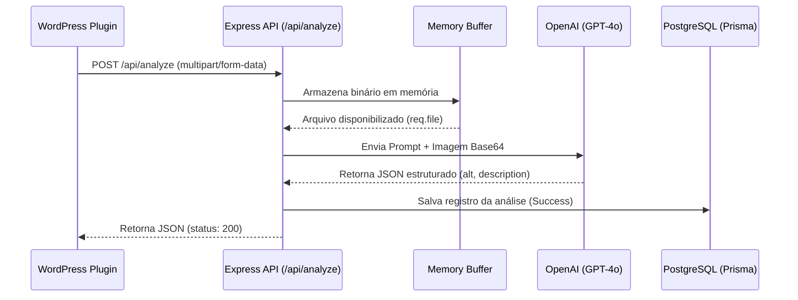

# Descreve AI - API Reference

Esta documentação descreve a API de integração do AI Gateway (Descreve AI), criada para suportar chamadas externas como o plugin **WP Acessível JINC**.

## Base URL

`http://localhost:3000` (ou domínio configurado no ambiente de produção).

---

## Endpoint: Análise de Imagem (Alt Text Generator)

Analisa uma imagem enviada em formato multipart e retorna o texto alternativo sugerido, salvando um histórico da transação no banco de dados.

**URL:** `/api/analyze`
**Method:** `POST`
**Content-Type:** `multipart/form-data`

### Parâmetros da Requisição

| Parâmetro | Tipo | Descrição |
|---|---|---|
| `image` | `File` | **Obrigatório**. O arquivo binário da imagem (PNG, JPEG, WEBP). Limite recomendado: 10MB. |
| `language` | `String` | *(Opcional)* Idioma para geração do alt-text. Padrão: `pt-BR`. |

### Exemplo de Requisição (cURL)

```bash
curl -X POST http://localhost:3000/api/analyze \
  -F "image=@/caminho/para/imagem.jpg"
```

### Respostas

**Sucesso (200 OK)**

```json
{
  "success": true,
  "alt": "Homem apresentando gráficos num tablet em uma sala de reunião",
  "description": "Descrição detalhada completa gerada pela IA, expandindo o conteúdo visual...",
  "status_code": 200
}
```

**Erro - Arquivo Ausente (400 Bad Request)**

```json
{
  "success": false,
  "error": "Nenhuma imagem foi enviada na requisição multipart/form-data."
}
```

**Erro - Falha na IA / Timeout (500 Internal Server Error)**

```json
{
  "success": false,
  "error": "Falha de comunicação com o provedor de IA (OpenAI)."
}
```

---

## Diagrama de Fluxo (Gateway Architecture)


